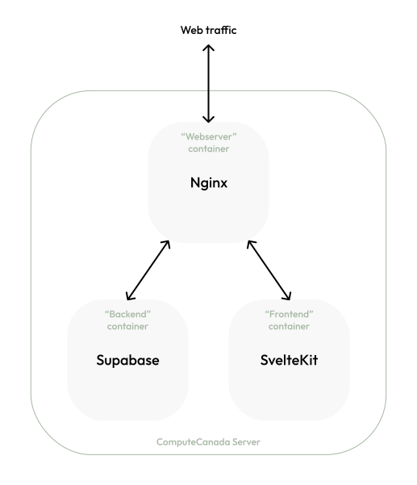

<h1 align="center">
  
</h1>

## General

### See it live

:pick: Under construction :pick:

### Stack

This project's stack is organized throughout packages respective of each service, such as:

- __The [frontend](/frontend)__
  - [SvelteKit](https://kit.svelte.dev/) as the SSR-capable frontend framework
    - The targeted distribution environement is Nodejs, thus we are here using the _SvelteKit_ ecosystem's [node adapter](https://kit.svelte.dev/docs#adapters)
- __The [backend](/backend)__
  - [Supabase](https://supabase.io/) for the PostgreSQL database and authentication services
    - [PostGIS](https://postgis.net/) extension for the GIS related types and functions
- __The [web-facing server and reverse-proxy](/webserver)__
  - Nginx

### Service packages

The packages are outlined in [pnpm-workspace.yaml](pnpm-workspace.yaml).

<p align="center">
  
</p>

## Getting started

### Using the prescribed package manager

The mono-repo is scaffolded on `pnpm`'s workspace feature. Make sure to work using `pnpm` rather than `npm`. This is to allow dependency optimizations and globally cached packages on your machine.

```sh
npm install -g pnpm
```

### Completing your local setup

Before building or starting any service, make sure to define the required environment variables in a `.env` file at the root of the repo by using [`template.env`](template.env) as a guideline.
The `.env` file is not included in commits, and never should be, as it can contain sensitive information for service authentications.

### Running scripts

For the time being, the only global (workspace level) scripts defined are to install the app(s).
You can install everything at once:

```sh
pnpm install
```

or install specific service packages

```sh
# Frontend
pnpm install:frontend

# Backend

# Webserver
```

For more granular scripts, make sure to `cd` into a package's directory.

## To do

- [ ] Setup nginx
- [ ] Setup self-hosted supabase services' package(s)
- [ ] Setup deployment pipeline
